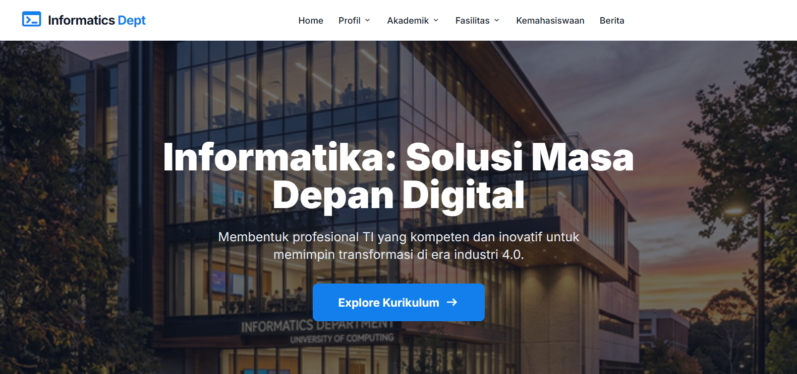

# Website Departemen Informatika

Website profil resmi Departemen Informatika yang dirancang dengan estetika modern, performa tinggi, dan fitur interaktif lengkap. Project ini dibangun untuk memberikan informasi komprehensif mengenai kurikulum, fasilitas, sejarah, dan struktur organisasi departemen.

## Preview



## 🚀 Fitur Unggulan

- **Desain Premium**: Antarmuka berbasis Tailwind CSS dengan estetika industri 4.0 yang mendukung Mode Terang (Light) dan Mode Gelap (Dark).
- **Struktur Organisasi Interaktif**: Visualisasi hierarki kepemimpinan menggunakan grafik dinamis Apache ECharts yang responsif.
- **Navigasi Cerdas**: Navbar dengan dropdown multi-level dan menu mobile yang interaktif (ikon toggle burger ke X).
- **Animasi Scroll**: Integrasi library AOS (Animate On Scroll) untuk pengalaman pengguna yang lebih hidup.
- **Konten Dinamis**: Carousel berita dan kegiatan mahasiswa yang dikelola secara modular.
- **Responsifitas Penuh**: Dioptimalkan untuk semua ukuran layar (Desktop, Tablet, dan Mobile).

## 🛠️ Stack Teknologi

- **Core**: HTML5, Vanilla JavaScript.
- **Styling**: Tailwind CSS (via CDN with JIT).
- **Visualisasi Data**: Apache ECharts (Struktur Organisasi).
- **Animasi**: AOS.js (Animate On Scroll).
- **Icons**: Google Material Symbols.
- **Typography**: Google Fonts (Inter).

## 📂 Struktur Folder

```text
/
├── akademik/               # Halaman kurikulum dan Kelompok Keahlian (KK)
├── assets/                 # Aset gambar, ikon, dan logo
│   ├── images/
│   │   ├── home/
│   │   ├── profile/
│   │   └── student/
├── css/                    # Custom styling (style.css)
├── fasilitas/              # Halaman Laboratorium dan Perpustakaan
├── js/                     # Logika aplikasi (main.js & components.js)
├── index.html              # Landing page utama
├── sejarah.html            # Profil sejarah departemen
├── visi-misi.html          # Visi, misi, dan sasaran
├── capaian-pembelajaran.html # Detail CPL (Capaian Pembelajaran Lulusan)
├── struktur-organisasi.html  # Visualisasi struktur organisasi
└── blog.html               # Portal berita dan kegiatan
```

## 📖 Cara Penggunaan

1.  **Clone Project**:
    ```bash
    git clone https://github.com/<username>/<repository>
    ```
2.  **Buka file `index.html`**:
    Anda bisa langsung membuka file `index.html` di browser pilihan Anda tanpa perlu server khusus (berbasis client-side).
3.  **Mode Gelap**:
    Sistem secara otomatis mendeteksi preferensi sistem Anda, atau Anda dapat menyesuaikan konfigurasi `html class="dark"` secara manual.

## 👥 Kontribusi

Project ini dikembangkan sebagai bagian dari tugas Pengembangan Aplikasi Berbasis Platform (PABP).

- **Fakultas**: Teknologi Informasi
- **Program Studi**: Informatika

---

© 2024 Departemen Informatika. All rights reserved.
